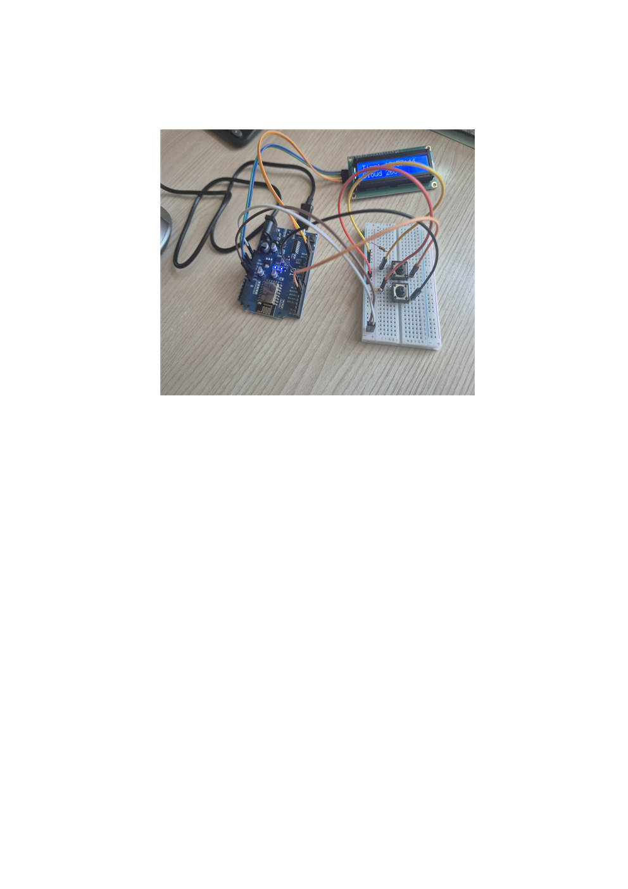

# Wemos D1 R1 지하철 LCD 도착 정보 표시 프로젝트

## 프로젝트 개요
Wemos D1 R1 보드와 LCD를 사용하여 4호선 지하철 도착 정보를 실시간으로 표시하는 프로젝트입니다.  
버튼을 누르면 다음 역의 도착 정보를 확인할 수 있으며, **실시간 시간과 현재 날씨 정보**도 함께 표시됩니다.

## 설치 및 사용 방법
1. Wemos D1 R1 보드와 LCD를 연결합니다.
2. Arduino IDE에서 `subway_lcd.ino` 파일을 엽니다.
3. Wi-Fi 정보는 코드 안에 직접 입력되어 있습니다.
4. 코드를 업로드한 후, LCD와 버튼으로 지하철 정보, 실시간 시간, 날씨를 확인합니다.

## 폴더 구조
subway-lcd-project/
├─ src/
│ └─ subway_lcd.ino
├─ include/
│ └─ config.example.h # 샘플, 실제 config.h는 업로드하지 않음
├─ docs/
│ ├─ circuit configuration001.png # 회로도 이미지
│ └─ demo.mp4 # 프로젝트 동영상 (다운로드용)
├─ README.md
└─ LICENSE

## 회로도

## 동영상
- 프로젝트 동영상은 `docs/demo.mp4`에 있습니다.  
- 필요하면 다운로드하여 확인하세요.

## 주의사항
- 실제 Wi-Fi 정보(config.h)는 보안상 업로드하지 않습니다.
- Wemos D1 R1은 **2.4GHz Wi-Fi만 지원**하며, 5GHz Wi-Fi는 연결되지 않습니다.
